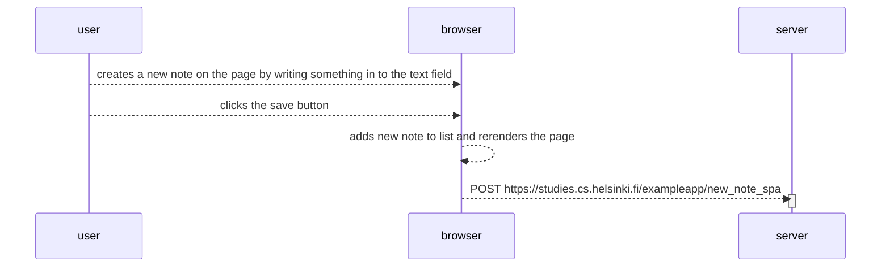

```mermaid
sequenceDiagram
    participant user
    participant browser
    participant server

    user-->>browser: creates a new note on the page by writing something in to the text field
    user-->>browser: clicks the save button
    
    browser-->>browser: adds new note to list and rerenders the page
    browser-->>server: POST https://studies.cs.helsinki.fi/exampleapp/new_note_spa
    activate server
    deactivate server
```

<!-- Create a diagram depicting the situation where the user creates a new note using the single-page version of the app. -->
